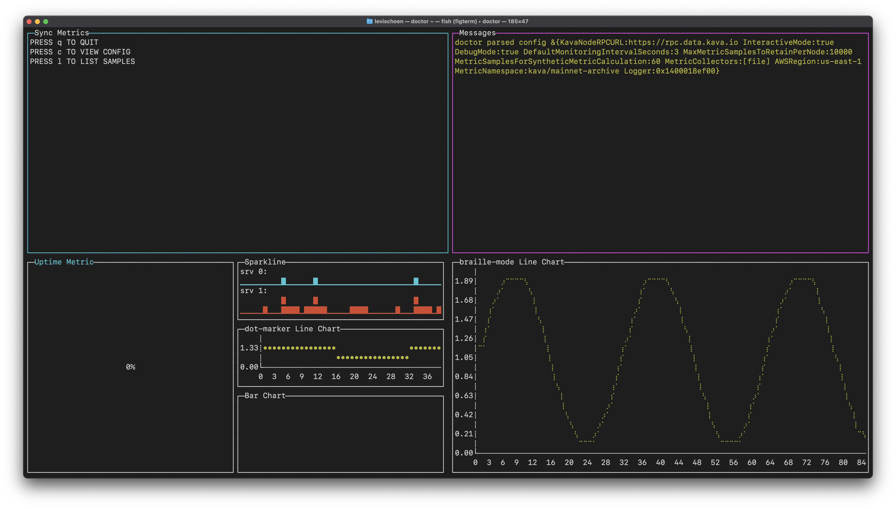
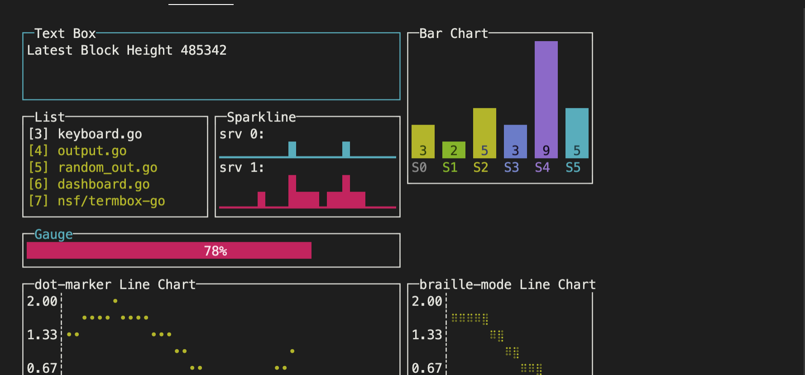

# doctor

Kava application and node infrastructure health monitoring daemon with configurable metric collection backends (e.g. stdout, file or AWS Cloudwatch).

## Usage

[System Overview](./docs/imgs/doctor-system-overview.jpg)

### Configuration

```bash
$ doctor --help
Usage of doctor:
      --autoheal                                          whether doctor should take active measures to attempt to heal the kava process (e.g. place on standby if it falls significantly behind live)
      --autoheal_blockchain_service_name string           the name of the systemd service running the blockchain. this is the service that gets restarted in the autoheal process (default "kava")
      --autoheal_initial_delay_seconds int                initial delay before autoheal attempts a restart. useful for allowing longer startup time for the chain, like during statesync initialization
      --autoheal_restart_delay_seconds int                number of seconds autohealing routines will wait to restart the endpoint, effective from the last time it was restarted and over riding the values downtime_restart_threshold_seconds no_new_blocks_restart_threshold_seconds (default 2700)
      --autoheal_sync_latency_tolerance_seconds int       how far behind live the node is allowed to fall before autohealing actions are attempted (default 120)
      --autoheal_sync_to_live_tolerance_seconds int       how close to the current time the node must resync to before being considered in sync again (default 12)
      --aws_region string                                 aws region to use for sending metrics to CloudWatch (default "us-east-1")
      --config_filepath string                            filepath to json config file to use (default "~/.kava/doctor/config.json")
      --debug                                             controls whether debug logging is enabled
      --default_monitoring_interval_seconds int           default interval doctor will use for the various monitoring routines (default 5)
      --downtime_restart_threshold_seconds int            how many continuous seconds the endpoint being monitored has to be offline or unresponsive before autohealing will be attempted (default 300)
      --health_check_timeout_seconds int                  max number of seconds doctor will wait for a health check response from the endpoint (default 10)
      --interactive                                       controls whether an interactive terminal UI is displayed
      --kava_api_address string                           URL of the endpoint that doctor should monitor (default "https://rpc.data.kava.io")
      --max_metric_samples_to_retain_per_node int         maximum number of metric samples that will be kept in memory per node (default 10000)
      --metric_collectors string                          where to send collected metrics to, multiple collectors can be specified as a comma separated list, supported collectors are [file cloudwatch] (default "file")
      --metric_namespace string                           top level namespace to use for grouping all metrics sent to cloudwatch (default "kava")
      --metric_samples_to_use_for_synthetic_metrics int   number of metric samples to use when calculating synthetic metrics such as the node hash rate (default 60)
      --no_new_blocks_restart_threshold_seconds int       how many continuous seconds the endpoint being monitored has not produce a new bloc before autohealing will be attempted (default 300)
```

Doctor can be configured using any combination of command line flags (detailed above), environment variables, and json configuration file.

By default Doctor will look for configuration file located at `~/.kava/doctor/config.json`.

An example configuration file is provided below:

```json
{
    "kava_api_address": "https://rpc.data.kava.io",
    "debug": true,
    "interactive": true,
    "default_monitoring_interval_seconds": 3,
    "max_metric_samples_to_retain_per_node": 10000,
    "metric_samples_to_use_for_synthetic_metrics": 60,
    "metric_collectors": "file,cloudwatch",
    "metric_namespace": "kava/mainnet-archive",
    "aws_region": "us-east-1",
    "autoheal": true,
    "autoheal_blockchain_service_name": "kava",
    "autoheal_sync_latency_tolerance_seconds": 120,
    "autoheal_sync_to_live_tolerance_seconds": 12,
    "downtime_restart_threshold_seconds": 300,
    "no_new_blocks_restart_threshold_seconds": 300,
    "health_check_timeout_seconds": 10,
    "autoheal_restart_delay_seconds": 2700
}
```

Any configuration provided via environment variables will override file based configuration:

```bash
DOCTOR_DEBUG=false doctor
```

Flags override any settings in configuration file or environment variables with command line flags:

```bash
doctor --debug=true
```

### Interactive Mode

Startup Screen



Interactive mode is still Work in Progress, Sync Metrics, Uptime Metric and Messages areas are in a v1 state.



### Daemon Mode

```bash
$ doctor --debug
https://rpc.data.kava.io uptime 100.000000%
doctor 2022/07/29 15:52:29 cli.go:195: node state {NodeInfo:{Id:06ff9460163caac703c44da1b2e3108e1ba087cd Moniker:kava-outbound-archive} SyncInfo:{LatestBlockHeight:894449 LatestBlockTime:2022-07-29 22:52:22.782040666 +0000 UTC CatchingUp:false}}
https://rpc.data.kava.io node 06ff9460163caac703c44da1b2e3108e1ba087cd is synched up to block 894449, 0 seconds behind live, hashing 0.172968 blocks per second, status check took 284 milliseconds
https://rpc.data.kava.io uptime 100.000000%
```

## Development

### Dependencies

### Building

To build a docker container with the kava and doctor binaries installed:

```bash
make build
```

To build the doctor binary for executing on your local dev machine:

```bash
make install
```

### Running

To run a dockerized kava node with doctor monitoring the kava application

```bash
make run
```

### Testing

To run the unit tests:

```bash
make test
```
