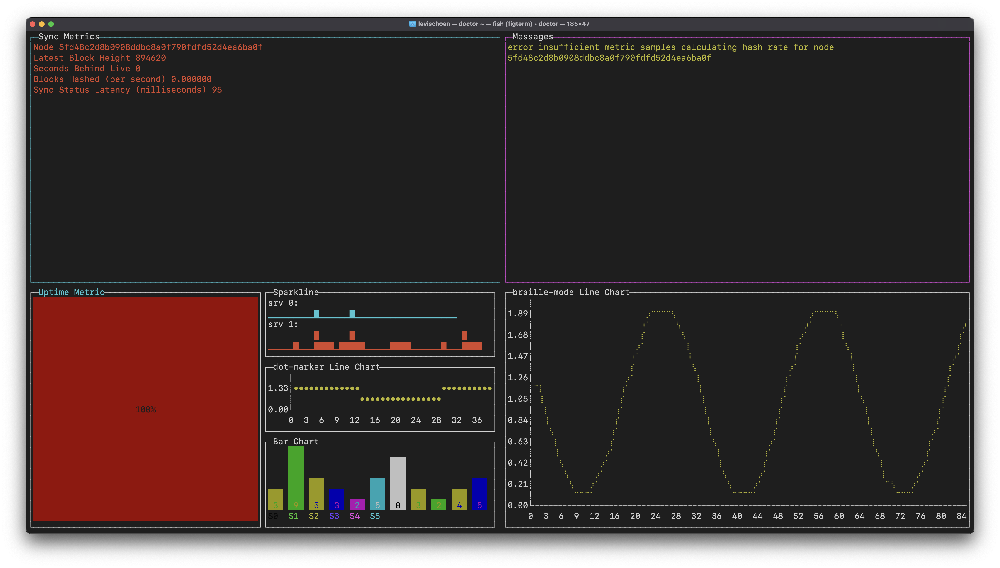

# doctor

Kava application and node infrastructure health monitoring daemon with configurable metric collection backends (e.g. stdout, file or AWS Cloudwatch).

## Usage

### Configuration

`~/.kava/doctor/config.json`

```json
{
    "kava_rpc_url": "https://rpc.public.us-west.testing.kava.io:443",
    "debug": true,
    "interactive": false
}
```

Can override any configuration provided via file with environment variables

```bash
DOCTOR_DEBUG=false doctor
```

Flags override any settings in configuration file or environment variables with command line flags

```bash
doctor --debug=true
```

### Interactive Mode



### Daemon Mode

```bash
$ doctor --debug
doctor 2022/06/30 16:15:59 main.go:89: debug logging enabled
doctor 2022/06/30 16:15:59 main.go:350: doctor config map[config-filepath:~/.kava/doctor/config.json debug:true interactive:false kava_rpc_url:https://rpc.public.us-west.testing.kava.io:443]
https://rpc.public.us-west.testing.kava.io:443 is synched up to block 498753 @ 1656630961
```

## Development

### Dependencies

### Building

```bash
make build
```

### Running

```bash
make run
```

### Testing

```bash
make test
```

### Publishing
